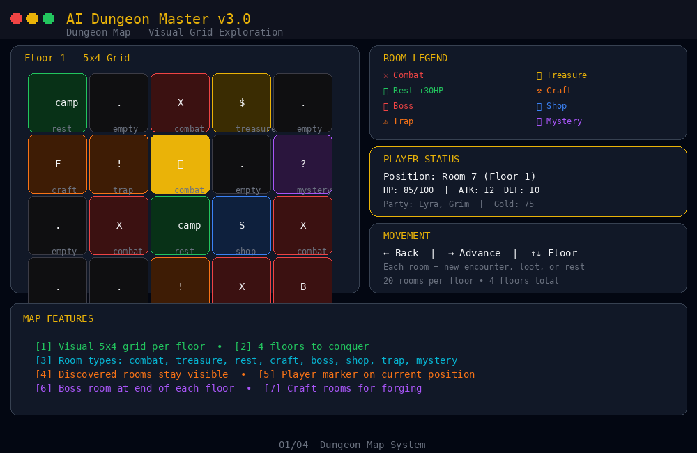
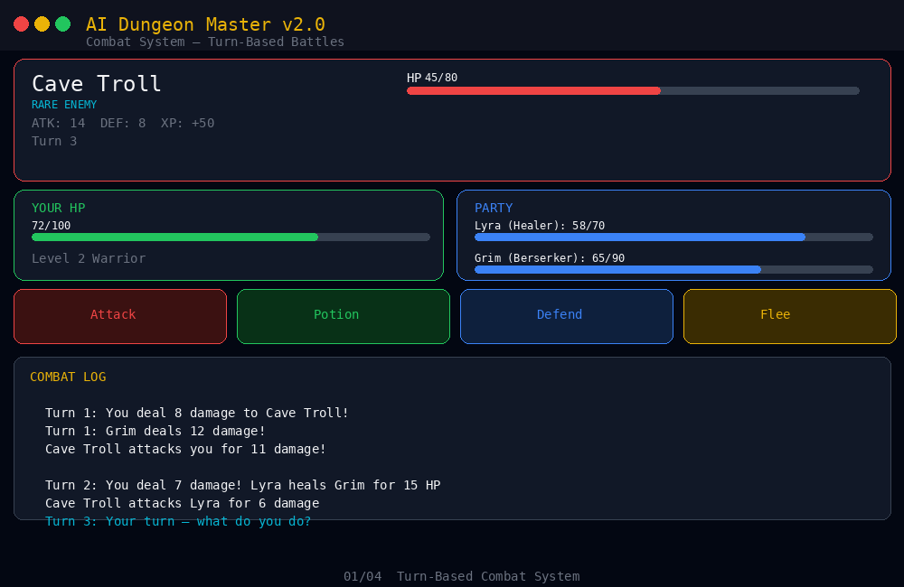
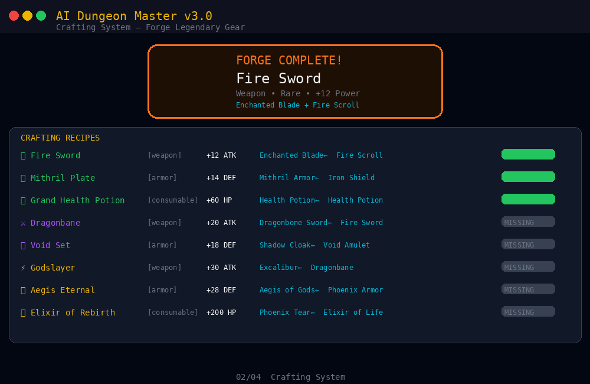
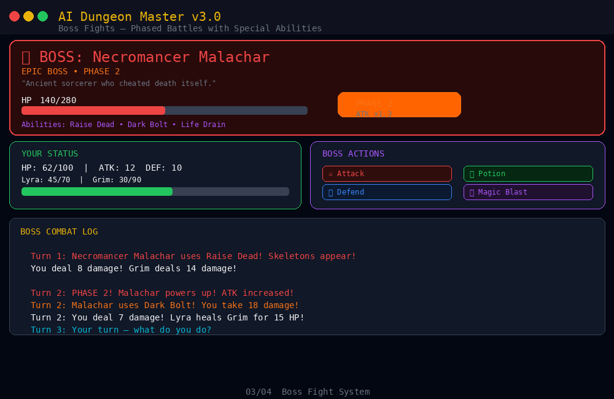
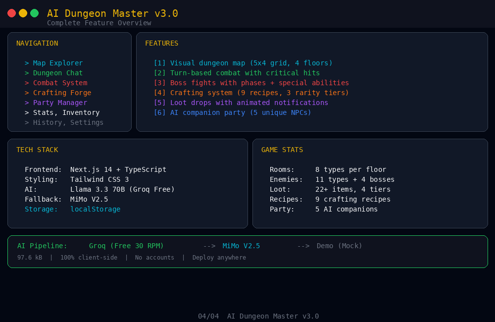

# 🎲 QuestFi AI v3.0

> AI-powered GameFi dungeon crawler. Unique adventures every playthrough.

[](https://questfi-ai-v3.netlify.app/)
[](https://questfi-ai-v3.netlify.app/)

✅ **Project is live and tested!** Deployed on Netlify with Groq API (Llama 3.3 70B) — all features working.

Built with **Next.js 14**, **TypeScript**, **Tailwind CSS**, and powered by **Llama 3.3 70B** (Groq) with MiMo fallback.

## ✨ Features

- 🗡️ **AI Dungeon Master** — Unique encounters, NPCs, and treasures every time
- ⚔️ **6 Character Classes** — Warrior, Mage, Rogue, Paladin, Necromancer, Ranger
- 📊 **Character Stats** — HP, Attack, Defense, Magic with visual stat bars
- 📜 **Quest Tracking** — Active/completed/failed quest log
- 💾 **Session History** — Resume any previous adventure (localStorage)
- 🔑 **Multi-Provider AI** — Groq (free) → MiMo → Demo mode fallback
- 🎮 **Quick Choices** — Click buttons to choose your action

## 🚀 Quick Start

```bash
npm install
npm run dev
```

Open [http://localhost:3000](http://localhost:3000)

## 🔑 API Keys (Optional)

| Provider | Cost | Rate Limit | Priority |
|----------|------|------------|----------|
| **Groq** | Free | 30 RPM | Primary |
| **MiMo** | Free tier | Variable | Fallback |
| **Demo** | Free | Unlimited | No key needed |

1. Get free Groq key at [console.groq.com/keys](https://console.groq.com/keys)
2. Enter it in Settings tab
3. Or leave empty for Demo mode with mock responses

## 🛠 Tech Stack

- **Frontend:** Next.js 14, TypeScript, Tailwind CSS
- **AI:** Llama 3.3 70B (Groq) + MiMo V2.5 fallback
- **Storage:** localStorage (no database needed)
- **Deployment:** Vercel / Netlify

## 📂 Project Structure

```
src/app/
├── api/generate/route.ts   # AI endpoint (Groq + MiMo + mock)
├── globals.css              # Game theme styles
├── layout.tsx               # Root layout
└── page.tsx                 # Main UI (all-in-one)
```

## 🎮 How to Play

### Getting Started
1. Open the app and go to **📊 Stats** tab to set your character name and choose a class
2. Each class has different strengths:
   - ⚔️ **Warrior** — High HP & ATK, balanced fighter
   - 🔮 **Mage** — Low HP but powerful magic attacks
   - 🗡️ **Rogue** — Fast & sneaky, good critical hits
   - 🛡️ **Paladin** — Tanky with high defense
   - 💀 **Necromancer** — Glass cannon, max magic power
   - 🏹 **Ranger** — Balanced stats, versatile

### 🗺️ Exploring the Dungeon
1. Go to **🗺️ Map** tab — you'll see a 5x4 grid representing the current floor
2. Click **→ Advance** to move to the next room, or click any discovered room to jump there
3. Each room has a type indicated by its icon:
   - ⚔️ **Combat** — Fight an enemy encounter
   - 💎 **Treasure** — Find random loot
   - 🏕️ **Rest** — Heal +30 HP at a safe campfire
   - ⚒️ **Craft** — Access the forging station to craft gear
   - 💀 **Boss** — Face the floor boss (tough fight!)
   - 🏪 **Shop** — Meet a mysterious merchant
   - ⚠️ **Trap** — Take random damage from hidden traps
   - ❓ **Mystery** — Something unknown awaits...

### ⚔️ Combat
1. When you enter a combat room, the **⚔️ Combat** tab opens automatically
2. You have 4 actions:
   - **Attack** — Deal damage based on your ATK stat (20% chance for critical hit = 2x damage!)
   - **Potion** — Use a health potion to restore +25 HP
   - **Defend** — Reduce incoming damage by 60% this turn
   - **Flee** — Try to escape (60% success rate, won't work against bosses)
3. If you have party members, they attack automatically each turn
4. Defeat enemies to earn XP, gold, and loot drops

### 💀 Boss Fights
1. Each floor has a boss at the end (room 20)
2. Bosses have special abilities and enter **Phase 2** when HP drops below 50%
3. In Phase 2, boss attacks deal 1.3x more damage
4. You get a bonus **✨ Magic Blast** attack (deals magic stat × 2.5 damage)
5. Bosses always drop legendary loot!

### ⚒️ Crafting
1. Visit a ⚒️ Craft room on the map
2. Go to the **⚒️ Craft** tab to see available recipes
3. Each recipe requires specific ingredients from your inventory
4. Crafted items are often much stronger than what you find as loot
5. Legendary recipes require ingredients from defeated bosses

### 🎭 Party System
1. Go to the **🎭 Party** tab and click **+ Recruit** to find companions
2. Each companion has unique stats and personality
3. Party members fight alongside you in combat automatically
4. You can have up to 4 party members (including yourself)

### 💡 Tips
- Explore thoroughly — rest rooms and treasure rooms are scattered throughout
- Craft often — combining items creates much stronger gear
- Recruit companions — they significantly boost your combat power
- Save often — your progress is auto-saved to localStorage
- Try different classes — each playthrough can feel different!

## 📸 Screenshots

### 🗺️ Dungeon Map — Visual Grid Exploration


### ⚔️ Combat System — Turn-Based Battles


### ⚒️ Crafting System — Forge Legendary Gear


### 💀 Boss Fights — Phased Battles with Special Abilities


### 📋 Full Feature Overview


---

<div align="center">

**🎲 QuestFi AI V3.0** — Built with Next.js 14 & MiMo AI by [ramdantukangngahuntu1](https://github.com/ramdantukangngahuntu1)

[](https://nextjs.org)
[](https://typescriptlang.org)
[](https://tailwindcss.com)
[](https://groq.com)

</div>
